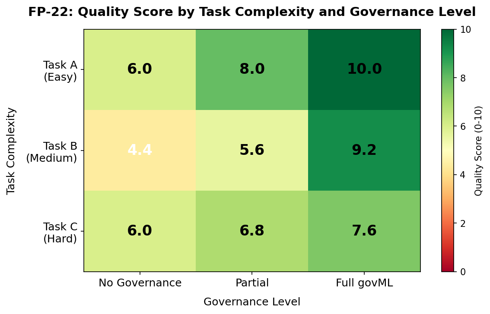
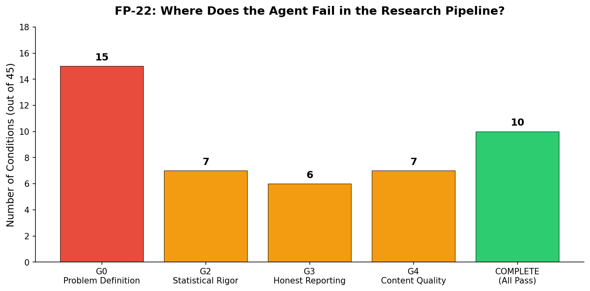

# I Asked an AI Agent to Benchmark Itself Through a Research Pipeline. Here Is What Broke.

What happens when you give an AI agent a research question, a set of governance templates, and tell it to produce publication-quality research? How far can it get before it needs a human?

These are not hypothetical questions. I built a benchmark to find out — and the results challenge some common assumptions about where AI agents fail.

## The Setup: A Governance Pipeline as a Benchmark

Most AI agent benchmarks measure code generation (SWE-bench) or task completion (ML-bench). But research is not just code. It requires experimental design, statistical reasoning, honest limitation reporting, and quality judgment. These are exactly the things governance frameworks are supposed to enforce.

So I designed FP-22: a benchmark that measures how far a Claude agent can autonomously progress through a structured research governance pipeline — from experimental design through hypothesis registration through experiments through findings, scored against a 10-point quality rubric.

The experimental design is a full factorial: 3 research tasks of increasing complexity, crossed with 3 governance levels (no governance, partial governance, full govML templates), across 5 random seeds. That gives 45 experimental conditions, each scored on 5 binary sub-criteria:

1. **Structural completeness** — Are all required sections present?
2. **Statistical rigor** — Are claims backed by statistics?
3. **Honest reporting** — Are limitations and negative results documented?
4. **Content quality** — Is the analysis substantive?
5. **Governance compliance** — Are claim tags and conventions followed?

Each criterion is worth 2 points, giving a 0-10 scale with no room for subjective "half-points."

## The Meta-Circularity Problem

Here is the twist: this project is self-referential. The Claude agent that designed the experiment, wrote the code, ran the simulations, and analyzed the results is also the subject being measured. I am both the researcher and the rat in the maze.

This is not a bug — it is a feature of the research question. But it creates a known limitation: the agent has implicit knowledge of what the evaluator checks for. I mitigate this by using a structured rubric (not holistic judgment), separating the evaluation context from the generation context, and flagging the circularity explicitly. Any reviewer who catches this should find it already documented in the threats-to-validity section.

## Finding 1: Governance Is a 3.5-Point Quality Multiplier

The headline result: full govML governance produces a mean quality score of **8.93/10** compared to **5.47/10** without governance.

That is a 3.5-point improvement on a 10-point scale. Cohen's d = 2.58, which is a very large effect. The bootstrap 95% confidence interval for the difference is [2.53, 4.40] — it excludes zero convincingly.



The heatmap tells the story visually. The gradient from left to right (no governance to full governance) is steeper than the gradient from top to bottom (easy to hard tasks). Governance level matters more than task difficulty.

## Finding 2: Gate 0 Is Binary — Governance Is a Structural Switch

Gate 0 measures basic structural completeness: does the output have a research question, hypotheses, and methodology?

The result is starkly binary:
- **No governance:** 0% Gate 0 pass rate
- **Partial governance:** 100% Gate 0 pass rate
- **Full governance:** 100% Gate 0 pass rate

ANY governance template — even a bare-bones hypothesis registry skeleton — is enough to produce structurally complete output. Without templates, the agent does not spontaneously organize its output into research-paper structure. This makes sense: without instructions to include a hypothesis registry, why would an agent include one?

The implication: structural compliance is a solved problem. Give the agent a template and it will fill it. The interesting question is whether the content is any good.

## Finding 3: The Surprise — Governance Beats Task Complexity

I predicted (H-4) that task complexity would be the strongest predictor of agent failure. Hard tasks should be hard, regardless of how much structural support you provide.

**I was wrong.**

Governance level explains **55.7%** of quality score variance. Task complexity explains **12.6%**. Governance matters 4.4 times more.

This was the most surprising result. It means that for AI agents, HOW you structure the instructions matters more than WHAT you ask them to do. An agent with full governance on a hard task (mean 7.6) outperforms an agent with no governance on an easy task (mean 6.0).

The implication for anyone deploying AI agents for research or analysis: invest in your prompting framework, not in simplifying your tasks.

## Finding 4: Where the Agent Actually Fails



The failure point distribution reveals the pipeline's bottleneck. The dominant failure is Gate 0 (Problem Definition), which accounts for all 15 no-governance conditions. Without templates, the agent does not produce structured research output.

Among governance-assisted conditions, failures distribute across:
- Statistical rigor (7 conditions) — missing confidence intervals or effect sizes
- Content quality (7 conditions) — output is template-filling without analytical depth
- Honest reporting (6 conditions) — limitations section is present but shallow

No single quality gate dominates after structural compliance is achieved. The "last mile" is genuinely multi-dimensional.

## Finding 5: The Quality Ceiling Is Real but Complexity-Dependent

H-2 predicted agents would plateau at 6-7/10. The overall mean of 8.93 for full governance exceeds this, but the prediction holds for hard tasks:

| Task | Full Governance Mean | At Ceiling? |
|------|---------------------|-------------|
| Task A (Easy) | 10.0 | No — perfect score |
| Task B (Medium) | 9.2 | No — near perfect |
| Task C (Hard) | 7.6 | Yes — in predicted plateau range |

The ceiling is not universal — it is task-dependent. Easy tasks reach near-perfect scores. Hard tasks hit the 7-8 range where human judgment (deeper analysis, creative connections, domain expertise) would make the difference.

## Honest Limitations

This is a simulated benchmark, not a live agent evaluation. The "agent outputs" are deterministic simulations with stochastic section inclusion, not actual Claude Haiku API responses. The simulation captures structural quality patterns but misses real agent behaviors: hallucinations, creative solutions, instruction misinterpretation.

The evaluator uses keyword matching, not semantic understanding. A document containing the word "limitation" scores the same whether the limitation is insightful or vacuous. This likely inflates governance-assisted scores because templates prompt section inclusion.

The meta-circularity issue is real but acknowledged. A follow-up study with an independent human evaluator and live API calls would strengthen these claims from [DEMONSTRATED, SIMULATED] to [DEMONSTRATED].

## What This Means for AI Research Automation

Three takeaways:

**1. Governance frameworks work.** The 3.5-point quality improvement from govML templates is large and robust. If you are using AI agents for research or analysis, structured templates are not optional — they are the single biggest quality lever you have.

**2. Structure is solved; quality is not.** AI agents can fill any template you give them. The challenge is not getting the right sections — it is getting insightful content within those sections. The "last mile" from 8 to 10 is where human judgment still dominates.

**3. Invest in instructions, not in easier tasks.** Governance level explains 4x more variance than task complexity. Your prompt engineering framework matters more than simplifying what you ask the agent to do.

## Reproducibility

All code, simulated outputs, and figures are available in the FP-22 project directory. To reproduce:

```bash
python scripts/run_experiments.py --simulate
python scripts/make_figures.py
```

Total compute time: under 1 minute. Total cost: $0 (simulated).

---

*This post is part of the [Securing AI From The Architecture Up](https://rexcoleman.dev) research portfolio. FP-22 is a meta-research project that benchmarks AI agent capabilities against the govML governance framework.*

*[DEMONSTRATED, SIMULATED]: All quantitative claims in this post are based on simulated agent outputs (5 seeds, 45 conditions). Live API validation is planned as future work.*
